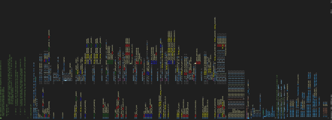
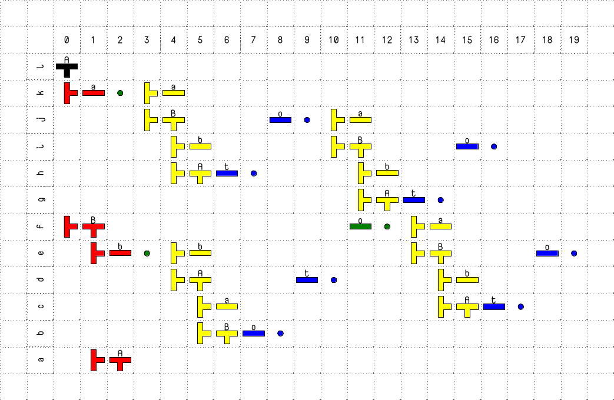
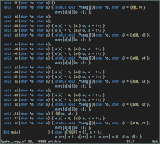

1. **In the beginning was the Step, and the Step was with the Machine, and the Step was the Machine.**
The Step is the fundamental unit of execution in the machine. It represents a bounded execution interval in which state, control flow, and semantic context are jointly defined and advanced.

2. **From the Step flows composition.**
Composition is defined in terms of Steps. A Step may contain nested Steps, may initiate execution of a subgrammar, and always executes within explicit bounds, producing a well-defined result upon completion.

3. **All grammars are executed through the Step.**
Grammar execution is mediated exclusively by Steps. Without execution by a Step, a grammar remains a static specification and does not induce computation.

4. **In the Step was the power to compose without ceremony.**
The Step functions as the primary unit of composition. It subsumes roles typically assigned to functions, objects, or lambda abstractions by unifying control flow and semantic interpretation within a single executable construct.

5. **This form of composition cuts through accidental complexity.**
This model reduces accidental complexity by making execution boundaries explicit. Systems that rely on layered abstractions without exposing execution boundaries obscure the locus of computation and hinder precise reasoning about behavior.

# c-machine.c
[](./docs/ss_166.png)


This is a specification of a computing machine directly specified (Godelized) in the C language.

It is a mathematical machine that can handle any form of CFG-like grammar.
It threads grammar rules as executable double-edged arrays.
It executes them and systematically explores all possible choices.

Think of it as a specified machine in hardware language, such as in C.

In assembly.
In instruction set architecture.
In the language of hardware/CPU.

Now, the instruction set architecture of the CPU is specified with the
language of the physical world, by transistors, by physics. Yes, it was first 
described in academic language as a [Turing machine](https://www.cs.virginia.edu/~robins/Turing_Paper_1936.pdf?now=%22to_see_definition_goto_page=3%22) - an α-machine.
So we have a machine within; We have two executors,
a nested machine architecture, the CPU, and the c-machine;
for that reason, the operational language for this two-headed
 unstoppable is written in two-edged arrays as executable pro-grammar rules.

## Axiomatic Step

The axiomatic step of the c-machine is the complete execution of one, tail-dispatching control function (e.g., Red_walk, choice, or, Yellow_descend2, etc.), which performs a constant number of tape read/writes, updates the explicit control pointers (t, r, s, a), and unconditionally transfers control to exactly one successor function. All grammar execution, nondeterministic choice, backtracking, left-recursion elimination, and semantic evaluation are reducible to finite sequences of such steps.

The machine state is fully captured by the single tape and four pointers, making execution boundaries, resource usage, and control flow directly observable and bounded.

Here, we can apply the divide-and-conquer principle.
Look, we are computing the result, building the AST, and parsing by the rules of grammar at the same time without interleaving logic code lines, without accidental complexity.

```javascript
// https://github.com/Antares007/s-machine same beast for js
import {PinkΤRed_descend, and, or} from './s.js'
class Programmer {
  constructor(o, s) {
    this.o = o;
    this.pro_grammar = { o: s, t: 0, a: 0, r: 0, s: s.length, symbols: [], axioms: [], data_states: [] };
  }
  DBT(opcode, symbol, set) {
    var { o, a } = this.pro_grammar;
    o[a++] = opcode;
    if ((o[a++] = set.indexOf(symbol)) === -1)
      (o[a - 1] = set.length, set.push(symbol));
    return this.pro_grammar.a = a, this;
  }
  D(symbol) { return this.DBT(1, symbol, this.pro_grammar.symbols); }
  B(ablock) { return this.DBT(2, ablock, this.pro_grammar.axioms); }
  T(symbol) { return this.DBT(3, symbol, this.pro_grammar.symbols); }
  go() { PinkΤRed_descend(this.o, this.pro_grammar) }
}

new Programmer({ b: 0, expr: Array(4) }, new Int16Array(2048))
  .D("S").T("expression").B(equalsTo(5)).B(print_expr).B(print_tree).B((o,s) => setTimeout(() => and(o,s), 0))
  .D("constant").B(term("1")).B(op_const(1)).B(ast_const(1))
  .D("constant").B(term("2")).B(op_const(2)).B(ast_const(2))
  .D("constant").B(term("3")).B(op_const(3)).B(ast_const(3))
  .D("primary").T("constant")
  .D("primary").B(term("(")).T("expression"). B(term(")"))
  .D("unary").T("primary")
  .D("unary").B(term("-")).T("unary").B(op_unary(a => -a)).B(ast_unary('-'))
  .D("unary").B(term("!")).T("unary").B(op_unary(a => !a | 0)).B(ast_unary('!'))
  .D("multiplicative").T("unary")
  .D("multiplicative").T("multiplicative").B(term("*")).T("unary").B(op_binary((a,b) => a*b)).B(ast_binary("*"))
  .D("multiplicative").T("multiplicative").B(term("/")).T("unary").B(op_binary((a,b) => a/b)).B(ast_binary("/"))
  .D("additive").T("multiplicative")
  .D("additive").T("additive").B(term("+")).T("multiplicative").B(op_binary((a,b) => a+b)).B(ast_binary("+"))
  .D("additive").T("additive").B(term("-")).T("multiplicative").B(op_binary((a,b) => a-b)).B(ast_binary("-"))
  .D("expression").T("additive")
  .go();

import astToString from './ast2asciitree.js'

function print_expr (o,s) { return (console.log(o.expr.slice(0, o.b).join("").padStart(o.expr.length), "=", o.rez[0]), and(o,s)) }
function print_tree (o,s) { return (console.log(astToString(o.ast[0])), and(o,s)) }
function term (str) { return (o,s) => setImmediate(() => (o.b < o.expr.length ? (o.expr[o.b++] = str, and) : or)(o,s)) }
function equalsTo (value) { return (o,s) => setImmediate(() => (o.rez[0] === value ? and:or)(o,s)) }
function binary_sa (k) { return action => (o,s) => (o[k] = [action(o[k][1][0], o[k][0]), o[k][1][1]], and(o,s)) }
function unary_sa (k) { return action => (o,s) => (o[k] = [action(o[k][0]), o[k][1]], and(o,s)) }
function id_sa (k) { return id => (o,s) => (o[k] = [id, o[k]], and(o,s)) }
function op_const (value) { return id_sa('rez') (value) }
function op_unary (operator) { return unary_sa('rez') (operator) }
function op_binary (operator) { return binary_sa('rez')(operator) }
function ast_const (value) { return id_sa('ast')({type:"Literal", value}) }
function ast_unary (operator) { return unary_sa('ast')((argument) => ({type:"UnaryExpression", operator, argument})) }
function ast_binary (operator) { return binary_sa('ast')((left, right) => ({type:"BinaryExpression", operator, left, right})) }


```

The diagram shows merged coloured configuration traces to investigate how left recursion is eliminated.
`A -> a, A -> B o, B -> b, B -> A t`


# godel_copy.c
[](./docs/ss_110.png)

It is a discrete mathematical object - a Turing machine with the
configuration of the [A-copy subroutine](https://en.wikipedia.org/wiki/Turing_machine_examples#A_copy_subroutine) expressed directly (Gödelized)
in a hardware language.

The Turing-machine tape is the o[1024] array, the head is s, and the transitions are encoded as pure control flow in C.

Mohamed Isham It’s a rare kind of implementation showing that we don’t need to
add accidental complexity when describing specifications in a systems language.
Most Turing-machine implementations use while(true) loops and transition tables,
which introduce branching and complexity.

Here the specification is the executable object — maybe a glimpse of
how academic writing could evolve when we learn to grow executable
languages that express problem-solution specifications directly.

